# CORRECTOR

### Corriger les copies. Préparer les cours. Le même outil.

**Vous scannez, il corrige.** Écriture manuscrite comprise, au barème qu'il a extrait de
votre corrigé — et chaque point reste rattrapable à la main.

**Vous demandez, il rédige.** Sujets, corrigés, feuilles d'exercices : à partir des
programmes officiels *et* des erreurs relevées sur les copies de vos élèves.

Onze matières, une seule installation, vos données chez vous.

<div align="center">


**7 minutes** · ▶ [Voir sur Tube Sciences & Technologies](https://tube-sciences-technologies.apps.education.fr/w/2Z8oD2Cv1A4bwUCm14bwNg)

*Tourné sur l'application réelle, sur une copie de baccalauréat anonyme et son corrigé officiel.
Aucune séquence simulée.*

</div>

---

## Installation en une ligne

```bash
git clone -b manage https://forge.apps.education.fr/durieuxvincent/corrector.git corrector-suite/API_manage \
  && corrector-suite/API_manage/deploy/install-all.sh
```

**Pas de compte, pas de clé, pas de jeton** — le dépôt est public, et les onze
correcteurs sont clonés avec la même URL que la gateway.

L'installateur détecte et installe ce qui manque (git, Node ≥ 22, outils de compilation,
LaTeX, pandoc…), clone les onze correcteurs, construit les fronts, génère les secrets,
installe le service et lance un smoke-test. Il est **idempotent** : relançable sans
risque.

<details>
<summary><strong>Cloner en SSH, et les options de l'installateur</strong></summary>

**En SSH**, pour qui compte contribuer :

```bash
git clone -b manage git@forge.apps.education.fr:durieuxvincent/corrector.git corrector-suite/API_manage \
  && corrector-suite/API_manage/deploy/install-all.sh
```

L'installateur ouvre une **interface en terminal** : bannière, contrôle des prérequis
ligne à ligne, menu à cases cochables pour les capacités (flèches, espace, `a` tout,
`n` rien, entrée), puis un récapitulatif encadré des capacités réellement obtenues.

| Option | Effet |
|---|---|
| `--yes` | non interactif (l'affichage reste, les questions disparaissent) |
| `--complet` | 12 services au lieu d'un seul |
| `--only pc,fr` | ne traite que ces correcteurs |
| `--no-services` | n'installe pas les unités systemd |
| `--no-extras` | saute LaTeX / pandoc / SearXNG / tailscale |
| `NO_TUI=1` | sortie texte simple, pour un journal |

Les dépendances d'exécution passent par `deploy/install-extras.sh` : LaTeX + XeLaTeX
(~1,5 Go) pour le PDF, pandoc pour le DOCX et l'éditeur Word, SearXNG (conteneur) pour
la recherche web, tailscale pour l'exposition. LaTeX et pandoc sont **cochés par
défaut** ; chacune reste refusable, et sans elles le client dégrade proprement
(boutons masqués, repli `.tex`/Overleaf).

Le script ne se contente pas de constater la présence des binaires : **il compile un
document LaTeX d'essai et fait un aller-retour pandoc réel**, puis annonce les capacités
mesurées. À surveiller sur une distribution ancienne : l'éditeur Word de l'assistant
exige **pandoc ≥ 2.15** (option `--sandbox`) — l'export DOCX simple, lui, se contente de
n'importe quelle version.

</details>

---

## Ce que ça fait, écran par écran

### On arrive, et il y a deux portes

Corriger des copies, ou préparer le cours. L'accueil salue le professeur par son
prénom, compte ce qui a déjà été fait, et rappelle où on s'était arrêté.


### La classe arrive de Pronote

Un export CSV, et les colonnes sont reconnues toutes seules. Les élèves ainsi
rattachés alimenteront ensuite tout le suivi de l'année.

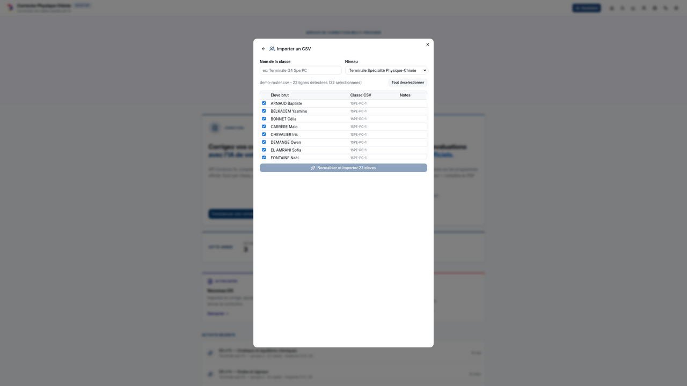

### Vous réglez l'exigence — pas lui

C'est l'étape où le professeur garde la main. Indulgent, normal, exigeant. Double
correction par un **second modèle**. Atténuation de la pénalité d'orthographe pour un
élève bénéficiant d'un aménagement. Domaines du programme à cibler. Le programme
officiel du niveau est injecté automatiquement dans la correction.

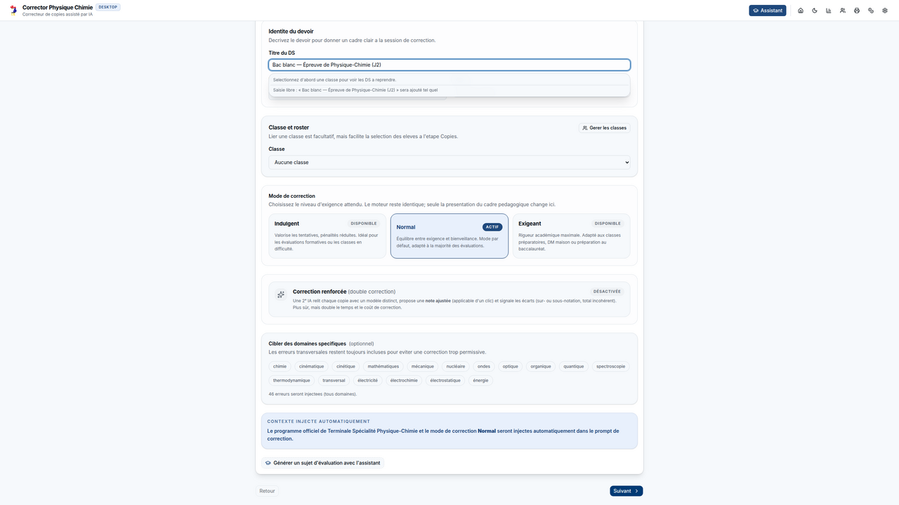

### Les copies entrent par où vous voulez

Le fichier, la photocopieuse du couloir, ou **le QR code** : vous scannez avec le
téléphone, vous photographiez les copies, elles atterrissent dans la correction en
cours.


### Le barème, il le lit dans votre corrigé

Déposez le corrigé officiel — PDF, photos, Word, ou du texte collé. Il en extrait le
barème, exercice par exercice, points compris. Pas encore de corrigé ? L'assistant le
rédige depuis le sujet.

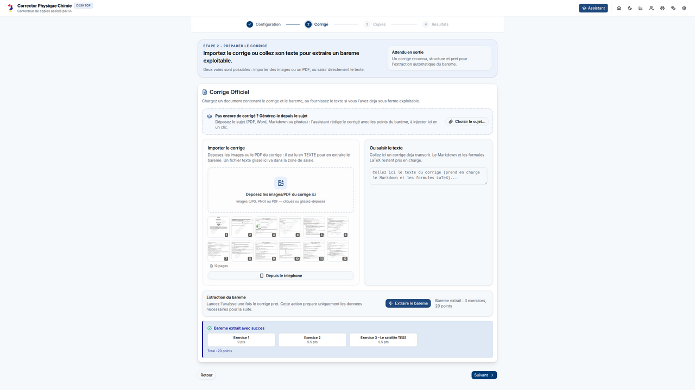

### Ou alors vous ne scannez rien du tout

Copies déjà corrigées à la main ? **Dictez.** Appréciation, remarques, erreurs et note
sont structurées automatiquement — sans photos, sans OCR. La classe défile élève par
élève : espace pour enregistrer, entrée pour valider et passer au suivant.

**Et si vous énoncez la note à l'oral, c'est elle qui prime.** Sinon une note est
proposée, toujours modifiable. L'audio n'est jamais conservé.

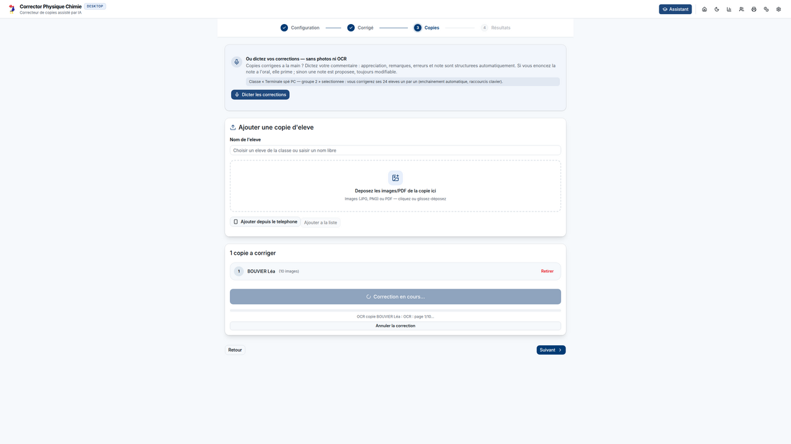

### La copie revient annotée, pas juste notée

Note, appréciation, points forts, axes de progrès, conseils. Et surtout : **les doutes
du correcteur sont signalés** — « je n'ai pas pu lire ce passage, à vérifier sur la
copie ». Rien n'est verrouillé : chaque point se rattrape à la main.

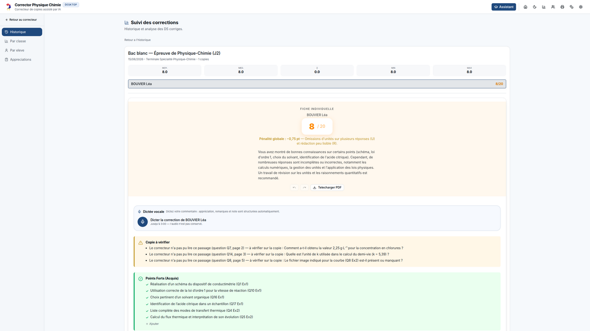

Le détail descend jusqu'à la sous-question, avec les erreurs typées selon un
dictionnaire propre à la discipline.

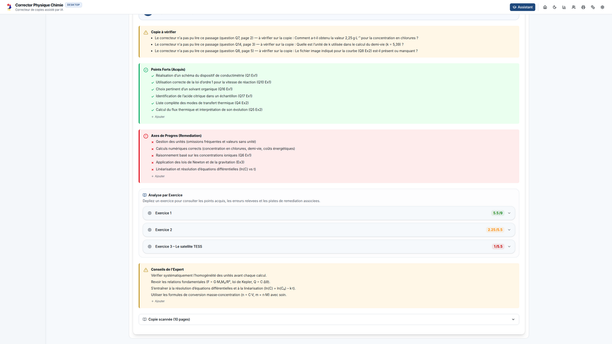

### Puis l'année se dessine toute seule

Historique, vue classe, vue élève. Distribution des notes, évolution de la moyenne,
erreurs récurrentes, domaines en difficulté. Rien à ressaisir : tout est calculé sur les
corrections déjà faites. Les appréciations de bulletin peuvent, elles aussi, être
dictées.

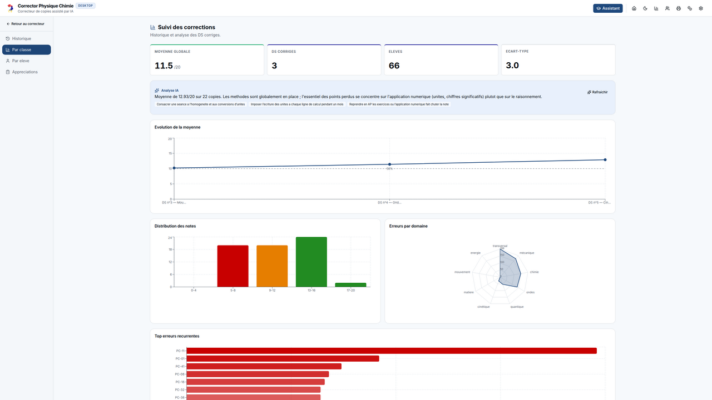

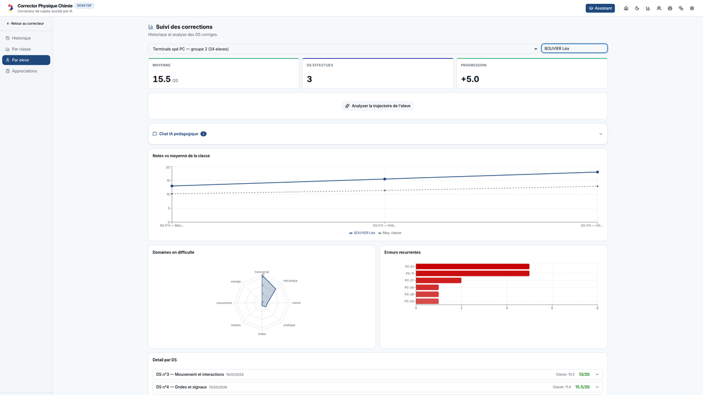

---

## L'assistant qui connaît vos élèves

Ce n'est pas un chat généraliste de plus. Il a les **programmes officiels** d'un côté,
et **vos propres données** de l'autre : vos devoirs, vos résultats, les erreurs relevées
sur une copie précise.

Demandez-lui sur quelles notions votre classe a perdu des points cette année. Il va
chercher dans vos corrections et vous répond avec les chiffres.

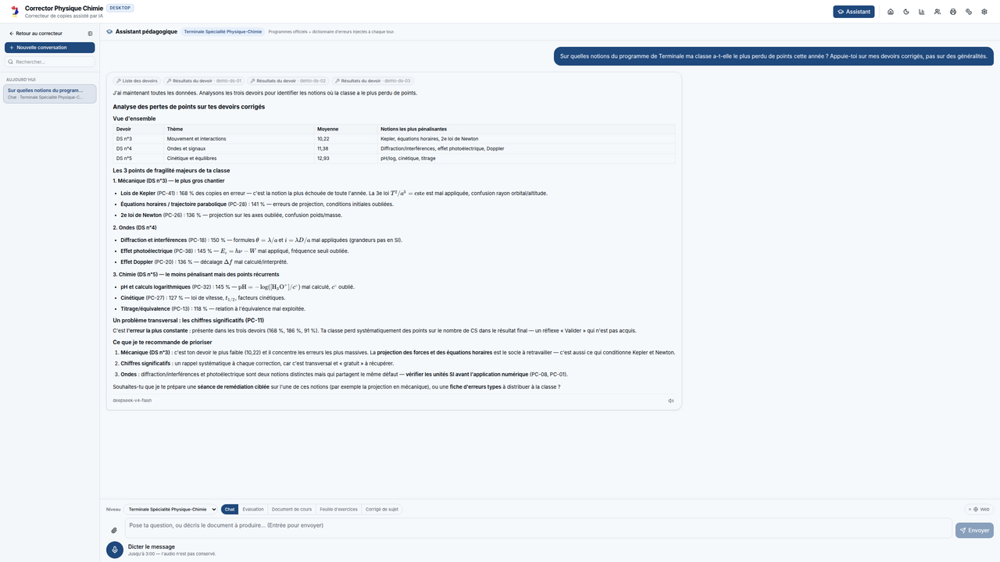

Il cherche aussi sur le web — **quand vous le lui demandez**, l'interrupteur est
explicite — et cite ses sources en puces cliquables.

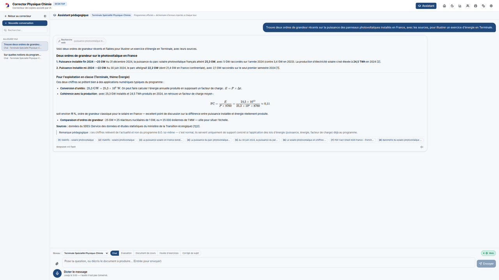

Et depuis la fiche d'un élève, il prépare des **exercices ciblés sur ses erreurs à
lui** : le prompt arrive pré-rempli avec ce qui a été relevé sur sa copie.

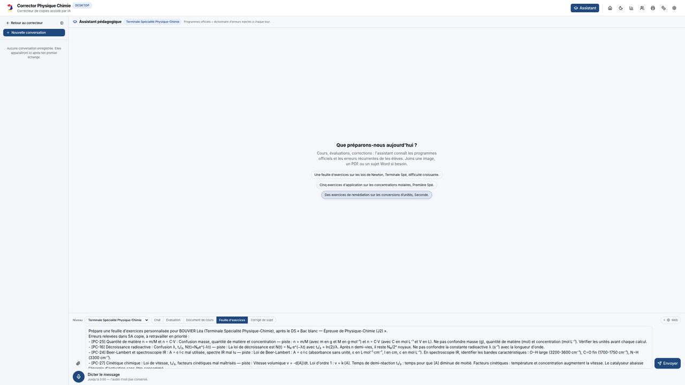

### Et ce qu'il produit est un vrai document

Pas un bloc de texte à recopier : un **PDF compilé**, prêt à photocopier, dans un
éditeur à trois onglets.

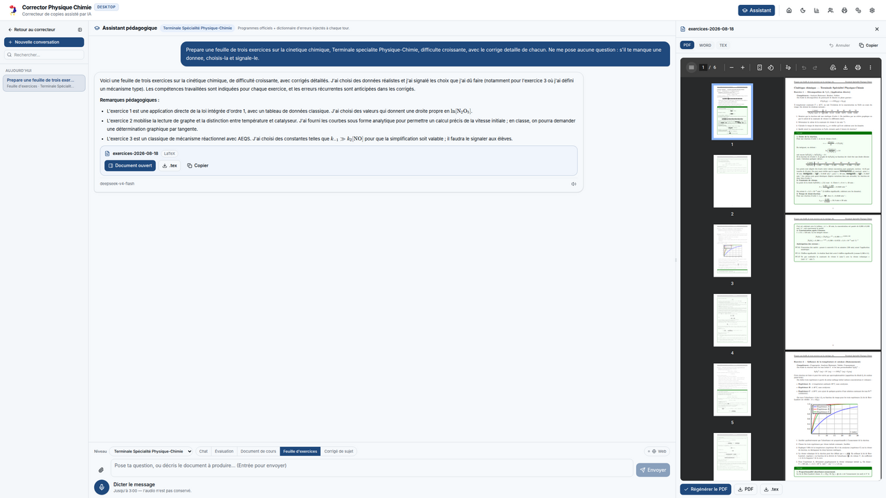

Le même document en **Word**, modifiable à la main — formules, tableaux et chimie
compris.

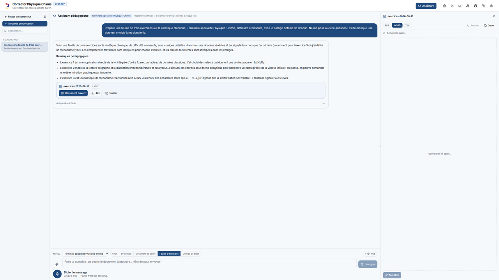

Et sa **source LaTeX**, avec la coloration syntaxique et un préambule verrouillé qui
garantit que ça compile.

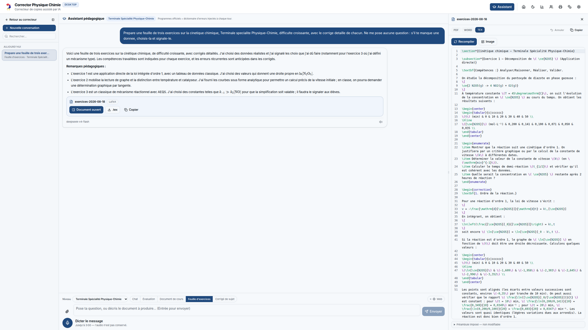

Le modèle sait **retoucher le document ouvert** plutôt que de le réécrire : il le relit,
applique la modification demandée, recompile, et vous dit ce qu'il a fait. Chaque retouche
est annulable.

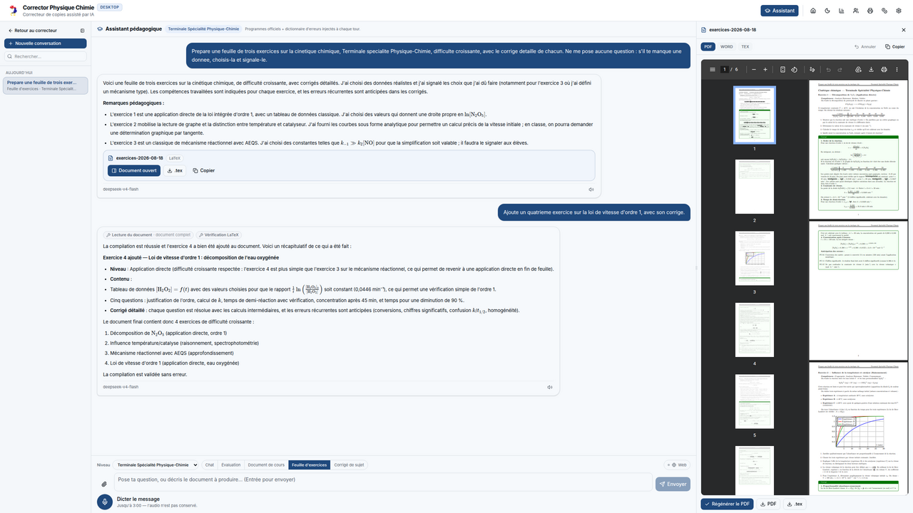 Les schémas TikZ, la chimie `mhchem` et les formules survivent à
l'export. Et le corrigé produit ici se réinjecte dans le correcteur : la boucle est
bouclée.

---

## Le modèle, c'est vous qui le choisissez

Mistral, **Albert (DINUM)**, GitHub Copilot, Kimi, Gemini, OpenAI, DeepSeek, Groq,
OpenRouter, Z.AI. Et pas seulement un modèle pour tout : **un modèle par tâche** — OCR,
barème, correction, appréciations, assistant — avec repli automatique si l'un disparaît
du catalogue. Le catalogue est détecté tout seul, la dépense est suivie et affichée en
euros comme en jetons.

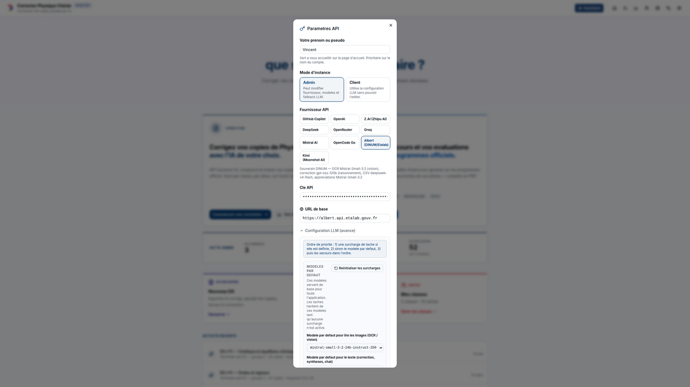

> **Vos copies restent chez vous.** Les données de classe vivent dans l'espace du
> compte, sur votre serveur. Dans le film, c'est **Albert**, l'IA souveraine de la
> DINUM, qui corrige.

---

## Onze matières, une seule méthode

Toutes les captures ci-dessus viennent du correcteur **Physique-Chimie**. Les dix autres
suivent exactement le même parcours, avec les spécificités de leur discipline : grilles
EAF et notation à paliers en français, dissertation et épreuve composée en SES, croquis
en HGGSP, parcours AMC en anglais, compétences C1.1–C3.3 au collège en technologie…

| Matière | Slug | Route | Branche | Port loopback |
|---|---|---|---|---|
| Physique-Chimie | `pc` | `/app/pc/` | `Pc` | 3001 |
| Français | `fr` | `/app/fr/` | `Fr` | 3005 |
| Néerlandais | `nl` | `/app/nl/` | `Nl` | 3009 |
| Espagnol | `es` | `/app/es/` | `Es` | 3013 |
| SVT | `svt` | `/app/svt/` | `Svt` | 3021 |
| Mathématiques | `maths` | `/app/maths/` | `Math` | 3025 |
| SES | `ses` | `/app/ses/` | `Ses` | 3029 |
| Technologie | `tech` | `/app/tech/` | `Tech` | 3033 |
| Anglais | `en` | `/app/en/` | `Anglais` | 3037 |
| Philosophie | `philo` | `/app/philo/` | `Philo` | 3041 |
| Histoire-Géographie | `hg` | `/app/hg/` | `Hgeo` | 3045 |

Source de vérité de ce câblage : [`deploy/forks.tsv`](deploy/forks.tsv), aligné sur
`server/routes/proxy.ts`.

---

## Comment c'est branché

Les onze correcteurs sont réunis derrière **API_manage**, une gateway qui gère
l'authentification, l'espace de travail persistant et une console d'administration.
Un compte est lié à un seul correcteur, choisi à l'inscription.

```
Tailscale Funnel (HTTPS public)  →  API_manage :3000  (auth + console admin)
                                       │  reverse-proxy gaté par session
        ┌──────────────────────────────┼──────────────────────────────┐
     /app/pc/   /app/fr/   /app/nl/   /app/es/  …  /app/hg/     (11 sous-apps loopback)
      :3001      :3005      :3009      :3013          :3045
```

Les sous-apps ne sont **jamais** exposées directement : elles tournent en loopback, et
toutes les routes `/app/*` exigent une session.

### Un seul process, toutes les capacités

C'est le **défaut**. La gateway sert elle-même les fronts des onze correcteurs **et
porte leurs routes serveur** (`/api/proxy`, `/api/latex/*`, `/api/search`) via
`server/routes/fork-api.ts`. Mesuré sur le poste de développement :

| | process Node | RSS mesuré |
|---|---|---|
| **économe** (défaut) | **1** | **173 Mo** |
| `--complet` | 12 | 1 084 Mo |

Les ~85 Mo par correcteur du mode complet ne sont pas l'applicatif : le serveur d'un
fork fait **44 lignes** et ne fait que servir des fichiers. C'est le `tsx`/esbuild
résident dans chaque service qui pèse. Rien d'autre ne change — mêmes URL, même écran de
connexion, même cloisonnement par compte. Les bundles sont en plus **pré-compressés** au
build (3,9 Mo → 1,5 Mo sur le plus gros).

Rendus **TeX, PDF et DOCX inclus**, vérifiés de bout en bout à travers la gateway
économe : un document avec formules, `siunitx`, chimie `mhchem` et tableau ressort en PDF
d'une page A4 et en `.docx` lisible.

C'est **100 % navigateur** : aucune application de bureau n'est installée ni requise.

<details>
<summary><strong>Quand garder les 12 process (<code>--complet</code>)</strong></summary>

Un seul cas le justifie : vouloir **redémarrer, mettre à jour ou déboguer un correcteur
isolément**, sans toucher aux dix autres ni à la gateway
(`systemctl --user restart corrector-svt`) — utile sur une machine de développement.
Sur un serveur, le mode économe n'enlève plus rien.

```bash
… /deploy/install-all.sh --complet     # 12 unités systemd
```

Basculer une installation existante, dans les deux sens, sans réinstaller — l'installateur
arrête et retire lui-même les unités devenues inutiles :

```bash
cd corrector-suite/API_manage && git pull && deploy/install-all.sh --yes
```

> **Historique, pour qui aurait connu l'ancien `--light`** : avant que la gateway ne
> porte ces routes, ce mode ne servait qu'une interface morte.
> `/app/<slug>/api/latex/health` répondait `200 text/html` (le repli SPA renvoyait la
> page à la place du JSON) et `/api/proxy` un `404` — donc ni rendu PDF, ni recherche
> web, **ni même correction**, puisque tous les appels LLM du navigateur transitent par
> ce proxy. C'est corrigé, et `tests/fork-api-parite.test.ts` garde les copies alignées
> sur les correcteurs.

</details>

---

## Exploitation

<details>
<summary><strong>Un dépôt, douze branches</strong></summary>

- **`manage`** (branche par défaut) — API_manage : la gateway, la console admin, et tout
  l'outillage `deploy/`. C'est ce que vous clonez pour installer la suite.
- **11 branches correcteurs** (voir le tableau) — chaque correcteur est un checkout
  d'une branche dédiée, frère d'API_manage sous un même dossier parent.

Cloner un seul correcteur (ex. Physique-Chimie) :

```bash
git clone -b Pc --single-branch https://forge.apps.education.fr/durieuxvincent/corrector.git API_corrector
```

</details>

<details>
<summary><strong>Mise à jour</strong></summary>

```bash
git -C corrector-suite/API_manage pull          # gateway (+ git pull par fork)
corrector-suite/API_manage/deploy/install.sh    # re-deps + rebuild
systemctl --user restart 'corrector-*.service'  # Linux
```

</details>

<details>
<summary><strong>Migration d'un serveur à l'autre</strong></summary>

`deploy/export-state.sh` (source) archive l'état vivant (SQLite + `.env`, après
checkpoint WAL) ; `deploy/restore-state.sh <archive>` (cible) le restaure. L'archive
contient tous les secrets → transfert sûr puis effacement des deux côtés. Les clés API
en base ne sont déchiffrables qu'avec le **même** `SESSION_SECRET`. Détail dans
[`deploy/README-DEPLOY.md`](deploy/README-DEPLOY.md).

</details>

<details>
<summary><strong>Exposition publique (Tailscale Funnel)</strong></summary>

```bash
tailscale funnel --bg --https=443 http://localhost:3000
```

URL publique : `https://<hostname>.<tailnet>.ts.net`. Les ports des sous-apps restent
loopback.

</details>

<details>
<summary><strong>Développement</strong></summary>

```bash
cp .env.example .env      # renseigner SESSION_SECRET, ADMIN_USERNAME, ADMIN_PASSWORD
npm install
npm run dev               # Vite :3000 + Express (proxy /api /app)
npm run lint              # tsc --noEmit
npm test                  # tsx --test
```

Structure : `server/` (Express — auth, proxy, admin, santé), `src/` (front React de la
gateway), `deploy/` (outillage d'installation), `data/api-manage.db` (SQLite,
gitignored). Pour lancer la suite complète en local sans systemd :
`scripts/launch-all.sh`.

</details>

---

<div align="center">

**Logiciel libre — EUPL-1.2**

*Les captures de ce README utilisent un jeu de données de démonstration entièrement
fictif. La copie corrigée dans le film est une copie de baccalauréat anonyme.*

</div>
